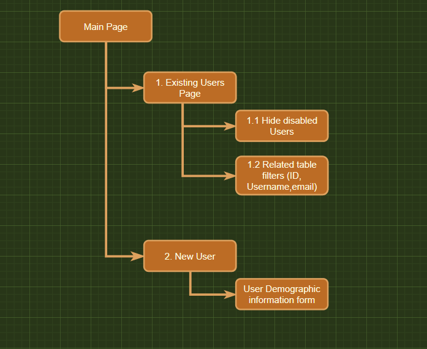
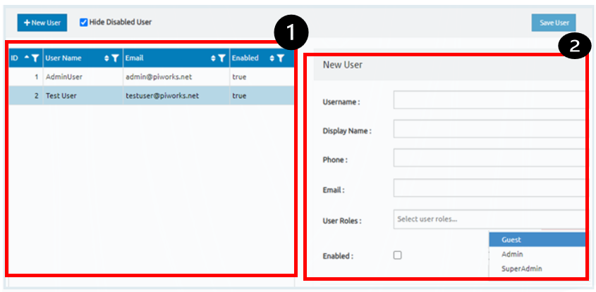

# UI specification document\: user management screen
___
___
## Introduction
This document the user management system. Provided in this document is the system's functionality.

## About this document
This document is divided into the following sections:

* __*UI structure and navigation description*__
* __*Screen Descriptions*__, this section provides a detailed description of the user interface and its components.
___
___
## __UI structure and navigation__

As can be seen from the diagram below, the structure primarily consist of two main parts (Existing users and new user form).

__Note:__ The numbers in the diagram provide reference to individual screen section/parts.

Initially the existing Users Page should be displayed. this page is a form a table displaying all the registered users. This table consist of the following fields.

* ID
* Username
* Email
* Enabled

*Each of these fields can be filtered.*

Second navigation is used for adding new users to the system. Once a new user is added to the system, they can be seen from the Existing users page.

___
___
## __Screen Descriptions__
The image below shows the two main parts of the interface.

1. __Existing Users page__
    * __Description__ : This page is a form a table displaying all the registered users
    * __Navigation__ : Only authorized personel can access this page. This would require some password before accessing this page. 
    * __Elements/Components__ : This part of the page consist of a table displaying all the registered users. This table consist of the following fields:
        * ID
        * Username
        * Email
        * Enabled (This section of the table indicates user status as "enabled" or "disabled").

    also this section consist of a button for __*adding new user*__ and a __checkbox__ for filtering(user status) purposes.
    
1. __Adding New User__
    * __Description__ : This part of the page is triggered when the user clicks New user Button. a new user form is displayed.
    * __Navigation__ : Only authorized personel can access this page. 
    * __Elements/Components__ :
        * __Username__: a textfield for providing new user username
        * __Display name__: a textfield for issuing a display name.
        * __Phone__: a textfield for providing user phonenumber.
        * __Email__: a textfield for providing user email address.
        * __User roles__: a dropdown list box. This field list all user roles. the user can be registered either as a *__Guest__ or __Admin__ or __SuperAdmin__*
        * __Enable__: A check box for enabling the user role on the system. this button will give rights/permission to the newly registered user to the system.
        * __Save User__: A button for saving new user to the system database. this button prior saving user should validate whether all the required fields are filled.
